---
html:
    toc: true
toc:
  depth_from: 2
  depth_to: 6
print_background: true
title: 富嘉花园36号楼公告栏   
---

# 富嘉花园36号楼公告栏

<!-- [TOC] -->

- ## 📑 [小区每日事务公告](#小区每日事务公告)   
- ## ⚡ [小区疫情公告](#小区疫情公告)   
- ## 🛒 [团购信息公告](#团购信息公告)

## 📢 团购信息公告

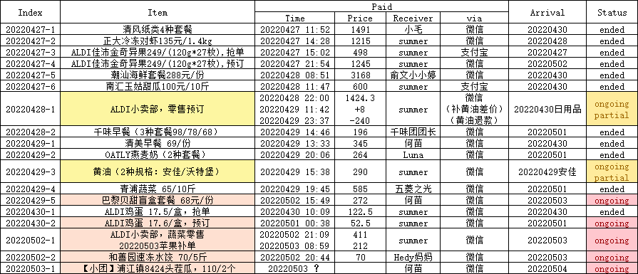

### 🛒 团购进行中 ongoing groupon

!!! bug 1️⃣ ALDI鸡蛋 17.6/盒【预订】, 🎁 预计到货：20220503
    | 20220430-2 ALDI鸡蛋17.5元/盒，预订 |   |      |
    |------|---|------|
    | 401  | 2 | 35   |
    | 1002 | 1 | 17.5 |
    | 总计  | 3 | 52.5 |

!!! bug 2️⃣ ALDI小卖部，蔬菜零售 & 苹果补单，🎁 预计到货：20220503
    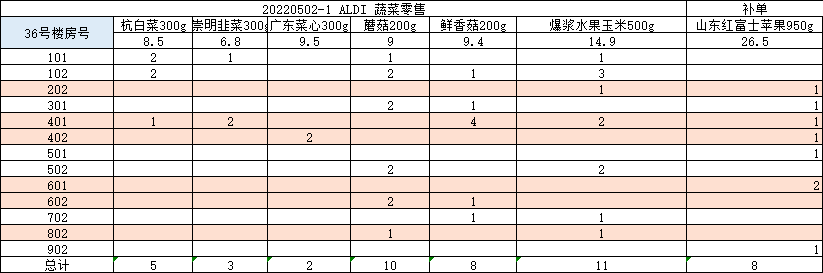

!!! bug 3️⃣ 巴黎贝甜盲盒套餐 68元/份, 🎁 预计到货: 20220503
    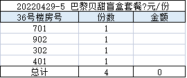

!!! bug 4️⃣ 和善园速冻水饺 70/5斤, 🎁 预计到货: 20220503
    | 20220502-2 和善园速冻水饺 70/5斤 |      |      |
    |--------------------------|------|------|
    |                          | 白菜猪肉 | 荠菜猪肉 |
    | 1101                     |   -   | 1    |
    | 301                      | 1    | -|

!!! question 4️⃣ 黄油（2种规格：安佳/沃特堡）, 🎁 沃特堡预计到货🚫
    <br>

    - 20220429 安佳 was delivered.

    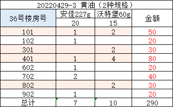

!!! question 7️⃣ ALDI小卖部【零售预订】, 🎁 剩余预计到货🚫
    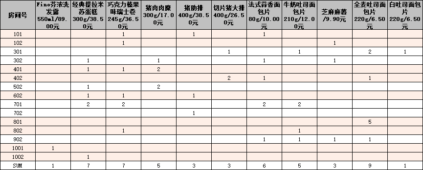


### 📊 已结束的团

!!! note 南汇玉姑甜瓜100元/10斤, 🎁 到货: 20220430
    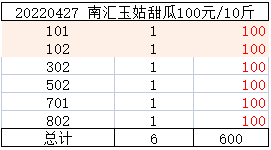


!!! note 清风纸类套餐（4种套餐）, 🎁 到货: 20220430
    套餐1）：清风抽纸24包+清风卷纸27卷，¥119元
    套餐2）：怡丽卫生巾日夜套装58片+安睡裤12片，¥100元
    套餐3）：清风酒精杀菌湿巾8包 (40抽/包），¥119元
    套餐4）：清风厨房卷纸12卷+绵柔洗脸巾3卷，¥80元
    
    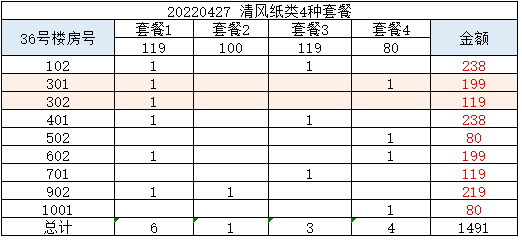

!!! note ALDI小卖部，零售预订, 🎁 部分到货: 20220430
    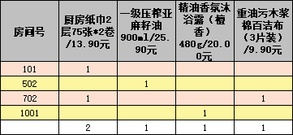

!!! note 潮汕海鲜套餐288元/份, 🎁 到货: 20220430
    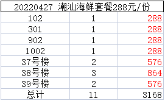

!!! note  清美早餐 69/份, 🎁 到货: 20220430
    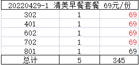

!!! note 1️⃣ 千味早餐（3种套餐98/78/68）, 🎁 预计到货: 20220501
    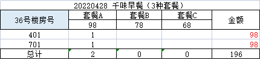

!!! note 2️⃣ 青浦蔬菜 65/10斤, 🎁 预计到货: 20220501
    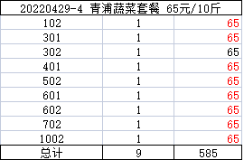

!!! note 8️⃣ OATLY燕麦奶（2种套餐）, 🎁 到货: 20220501
    | 20220429-2 OATLY燕麦奶（2种套餐） |      |     |
    |---------------------------|------|-----|
    | 36号楼房号                    | 咖啡大师 | 巧克力 |
    |                           | 139  | 125 |
    | 502                       | 1    | 1   |

!!! note 5️⃣ ALDI佳沛金奇异果249/(120g*27枚) 【预订】, 🎁 到货: 20220502
    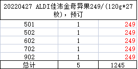


## 小区每日事务公告

### 📑 4月26日
```python
各位楼组长：
    按上级要求，今天全市大筛，要求各居民区上下午各做一次抗原，下午做全员核酸。
    今天的全员核酸意义重大，筛查比例和结果都关系到小区解封时间，请各位楼组长务必重视，做到不漏一人，不漏一户（不能下楼的老弱病残人员会安排医生上门采样。）谢谢各位配合！
```

### 📑 4月25日
```python
各位居民
    刚得到街道指令，所有封控小区今天上下午各一次抗原，请各位楼组长务必要监督好楼里的居民如实上报抗原检测结果，做到不漏一户，不漏一人。
    下午全小区做核酸检测，今天全部都是5：1混管，下楼做核酸。（27、28号的楼组长志愿者请务必辛苦通知居民应检尽检，避免有疏漏）时间大致是从上午10点到下午14：00结束。
```

```python
各位楼组长：
    为感谢楼道组长、志愿者在此次疫情防控期间志愿服务，街道发放少量食品聊表心意。根据数量，居委会拟每个楼道发放1箱榨菜、2箱火腿肠（1、2、26、27、28、22、23、33、34发放火腿肠3箱），请各位楼组长和志愿者自行安排分配。（发放对象为楼组长和楼道志愿者）另外，我们同时发放抗原试剂6次。请大家16：00后来领取。
```

### 📑 4月24日
```python
@所有人 各楼组长注意，预计上午9点后陆续发放政府物资，请知悉，谢谢！
```

```python
各位居民
    刚得到街道指令，所有封控小区今天上下午各一次抗原，请各位楼组长务必要监督好楼里的居民如实上报抗原检测结果，做到不漏一户，不漏一人。
    下午全小区做核酸检测，今天全部都是5：1混管。28、27号我们安排同组最后做，楼里的阳性和密接都已接走，也已多次在楼道消杀，街道和医院不再组织医生上门采样，请27号28号的楼组长志愿者动员居民按楼层从上到下顺序下楼做核酸，谢谢配合！
```

```python
街道来对小区楼栋外做全面消杀，现已消杀完毕。@所有人 
```

### 📑 4月23日
```python
各位居民
    刚得到街道指令，所有封控小区今天上下午各一次抗原，下午全小区做核酸检测。除27、28号楼单人单管，其余楼道5：1混管。（27号楼现无阳性，密接都已接走，等今天下午消杀完毕后全部下楼做。）
```

### 📑 4月22日 {ignore=false}

```python
各位居民：
为了尽快实现清零，街道要求对重点小区的重点楼道再次进行核酸检测，连测5天。经居委会研判决定：
1、重点筛查楼道为：1、16、26、27、28、40、61、62。
2、根据医生工位，我们分成2组上门筛查，单人单管。时间以医生到达小区为准，大致从早上10点开始到下午4点结束。
3、因已多日连续作战，及考虑风险因素，志愿者不参与此次筛查，全部由医生和居委干部完成。
4、其它非重点楼道继续一天2次抗原，今天我们还会发一批抗原试剂和预防中药，等我们整理好，发通知后楼组长来领取。
5、目前小区还不具备分区域划分防控等级，一旦条件成熟，我们即刻向街道申请，谢谢大家配合！
```

```python
@所有人 请各位楼组长和楼道的志愿者来居委会领取抗原试剂和中药。体量较大，建议带小推车。
```

### 📑 4月21日
```python
今天和昨天安排一样，上下午各一次抗原，下午核酸。
```

### 📑 4月20日
```python
各位居民
总攻的号角已经吹响，为尽快实现社会面清零目标，全区将于4月20日（今日）全面开展核酸检测。为做到不漏一户、不漏一人，大家可通过“敲门行动”，全面查验居民核酸检测情况，动员漏检人员及时参加核酸检测。今天具体安排如下：
一、抗原筛查
    第一次：10：30前，第二次：下午16：30前。
二、核酸筛查
    中午12时，具体等医生到达时间为准。核酸筛查采取==5:1==混采。
三、楼道消杀
    今天下午街道消杀队将对==16、40、27、28==楼道进行再次消杀。
谢谢各位！
```

### 📑 4月18日
```python
各位楼组长：
今天开始六院没有绿色通道，因此我们早上没有为大家配到药。
经努力我们改预约去闵行中心医院。我们一共配药人数230人。19日上午9点钟，预约人数30人。21日下午2点钟，预约人数100人。22日上午7:45分  ，预约人数100个。等配好药我们再通知大家取药，请大家知悉。
```
```python
各位楼组长：
街道下发口罩和莲花清瘟还有抗原试剂。因为体量太大，我们居委会无力分发到每个楼道。我们已将每个楼道分装完毕，请各位楼组长收到通知后来居委会领取。
1、一户20个口罩。
2、一人抗原试剂6份。
3、一户莲花清瘟2盒。
4、一个楼道2份防护服。
5、签收单你们只要发完打钩即可。
因为体量实在太大，请各位楼组长再邀请一位志愿者，来居委会排队领取，建议带好小推车。
下午我们还要做核酸检测，谢谢各位配合！
```

## 小区疫情公告

### 🔖 4月26日
🔔 小区清零第3天 🚩
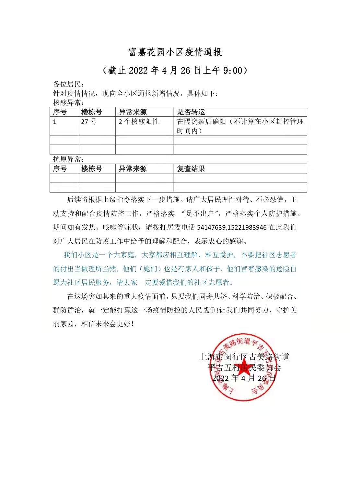

### 🔖 4月25日
🔔 小区清零第2天 🚩


### 🔖 4月23日
🔔 从今日起，小区清零 🚩
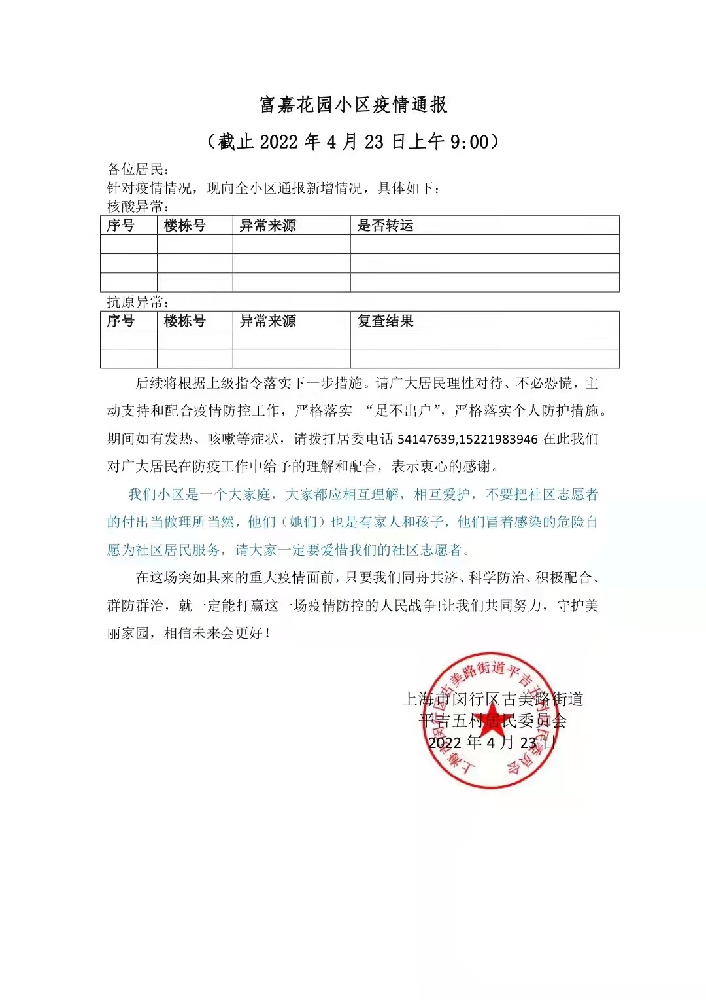

### ⚡ 4月22日


### ⚡ 4月21日


### ⚡ 4月20日


### ⚡ 4月19日


### ⚡ 4月18日


### ⚡ 4月17日


 


买菜流程

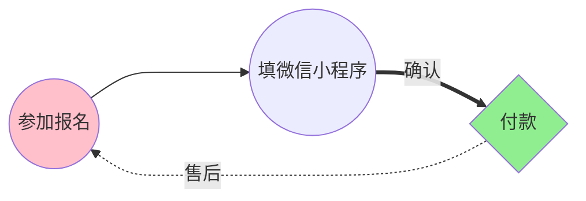

https://squidfunk.github.io/mkdocs-material/reference/admonitions/#supported-types

https://shd101wyy.github.io/markdown-preview-enhanced/#/


