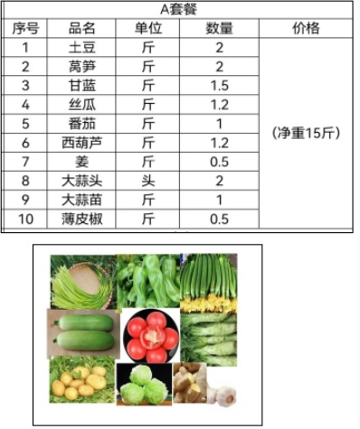
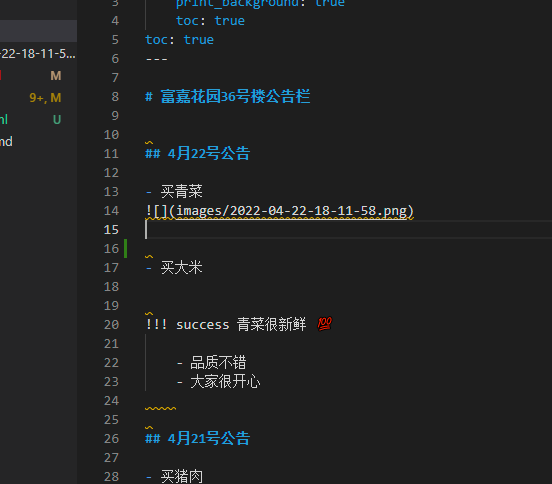
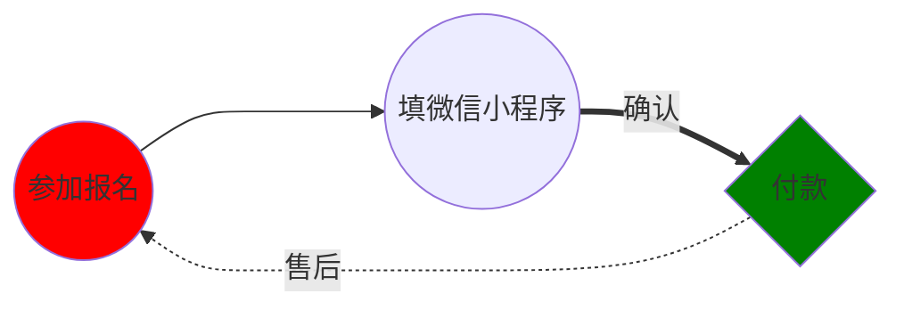

---
html:
    toc: true

print_background: true
    
---

# 富嘉花园36号楼公告栏

## 4月22号公告

- 买青菜

</img>

</img>

</img>

- 买大米

!!! success 青菜很新鲜 💯

    - 品质不错
    - 大家很开心
    

## 4月21号公告

- 买猪肉
- 买鸡蛋

!!!  鸡蛋比较小 🥚

    鸡蛋比我想像的小一半！ :angry:
    

## 4月20号公告

买菜流程

https://squidfunk.github.io/mkdocs-material/reference/admonitions/#supported-types

https://shd101wyy.github.io/markdown-preview-enhanced/#/
## 4月30号

[link to another link](./index2.html)