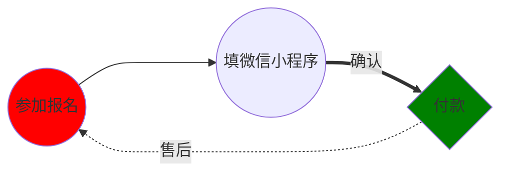

---
html:
    toc: true
toc:
  depth_from: 2
  depth_to: 6
jprint_background: true   
---

# 富嘉花园36号楼公告栏

<!-- [TOC] -->

- ## 📑 [小区每日事务公告](#小区每日事务公告)   
- ## ⚡ [小区疫情公告](#小区疫情公告)   
- ## 🛒 [团购信息公告](#团购信息公告)


## 小区每日事务公告


### 📑 4月22日 {ignore=false}

```python
各位居民：
为了尽快实现清零，街道要求对重点小区的重点楼道再次进行核酸检测，连测5天。经居委会研判决定：
1、重点筛查楼道为：1、16、26、27、28、40、61、62。
2、根据医生工位，我们分成2组上门筛查，单人单管。时间以医生到达小区为准，大致从早上10点开始到下午4点结束。
3、因已多日连续作战，及考虑风险因素，志愿者不参与此次筛查，全部由医生和居委干部完成。
4、其它非重点楼道继续一天2次抗原，今天我们还会发一批抗原试剂和预防中药，等我们整理好，发通知后楼组长来领取。
5、目前小区还不具备分区域划分防控等级，一旦条件成熟，我们即刻向街道申请，谢谢大家配合！
```

### 📑 4月21日
```python
今天和昨天安排一样，上下午各一次抗原，下午核酸。
```

### 📑 4月20日
```python
各位居民
总攻的号角已经吹响，为尽快实现社会面清零目标，全区将于4月20日（今日）全面开展核酸检测。为做到不漏一户、不漏一人，大家可通过“敲门行动”，全面查验居民核酸检测情况，动员漏检人员及时参加核酸检测。今天具体安排如下：
一、抗原筛查
    第一次：10：30前，第二次：下午16：30前。
二、核酸筛查
    中午12时，具体等医生到达时间为准。核酸筛查采取==5:1==混采。
三、楼道消杀
    今天下午街道消杀队将对==16、40、27、28==楼道进行再次消杀。
谢谢各位！
```

### 📑 4月18日
```python
各位楼组长：
今天开始六院没有绿色通道，因此我们早上没有为大家配到药。
经努力我们改预约去闵行中心医院。我们一共配药人数230人。19日上午9点钟，预约人数30人。21日下午2点钟，预约人数100人。22日上午7:45分  ，预约人数100个。等配好药我们再通知大家取药，请大家知悉。
```
```python
各位楼组长：
街道下发口罩和莲花清瘟还有抗原试剂。因为体量太大，我们居委会无力分发到每个楼道。我们已将每个楼道分装完毕，请各位楼组长收到通知后来居委会领取。
1、一户20个口罩。
2、一人抗原试剂6份。
3、一户莲花清瘟2盒。
4、一个楼道2份防护服。
5、签收单你们只要发完打钩即可。
因为体量实在太大，请各位楼组长再邀请一位志愿者，来居委会排队领取，建议带好小推车。
下午我们还要做核酸检测，谢谢各位配合！
```

## 小区疫情公告

### ⚡ 4月22日


### ⚡ 4月21日


### ⚡ 4月20日


### ⚡ 4月19日


### ⚡ 4月18日


### ⚡ 4月17日


- 买猪肉
- 买鸡蛋

!!!  鸡蛋比较小 🥚

    鸡蛋比我想像的小一半！ :angry:
    

## 团购信息公告

买菜流程



https://squidfunk.github.io/mkdocs-material/reference/admonitions/#supported-types

https://shd101wyy.github.io/markdown-preview-enhanced/#/
### 4月30号

[link to another link](./index2.html)